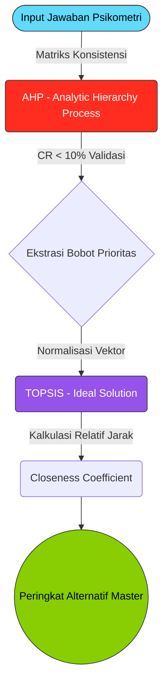

<!-- ANIMATED RAINBOW HEADER -->
<p align="center">
  
</p>

<!-- DYNAMIC TYPING TEXT -->
<p align="center">
  
</p>

<!-- ADVANCED BADGES -->
<p align="center">
  
  
  
  
</p>

<!-- ANIMATED STATUS ICONS -->
<p align="center">
  <a href="#"></a>
  <a href="#"></a>
  <a href="#"></a>
  <a href="#"></a>
  <a href="#"></a>
</p>


### 🌟 **Transformasi Pengambilan Keputusan dari Intuisi ke *Analitik Berbasis Bukti***

MajorMind bukanlah sekadar aplikasi tes kepribadian. Ini adalah **Sistem Pendukung Keputusan (DSS) Teralgoritma** yang mengeliminasi dominasi bias kognitif (seperti ekspektasi orang tua, prestige sesaat, dan tekanan teman). Melalui arsitektur hibrida yang menggabungkan instrumen psikometri, jarak *Euclidean*, hingga analisis vektor terstandarisasi, MajorMind mencocokkan profil otak dengan rasionalitas karir terunggul.

---

<details open>
<summary><b style="font-size: 1.25rem;">📑 Navigasi Dokumen Interaktif Terpusat</b></summary>
<br>

- [💠 Latar Belakang & Visi Utama](#-latar-belakang--visi-utama)
- [🛡️ Standar Privasi & Keamanan (Zero-Trust)](#️-standar-privasi--keamanan-zero-trust)
- [🧩 Pilar Fungsional (Penjelasan Animasi & Logika)](#-pilar-fungsional-penjelasan-animasi--logika)
- [⚙️ Mekanika The Engine (Kecerdasan Buatan)](#️-mekanika-the-engine-kecerdasan-buatan)
- [🚀 Integrasi & Pemasangan Eksklusif](#-integrasi--pemasangan-eksklusif)
</details>


## 💠 Latar Belakang & Visi Utama

Di Indonesia, lebih dari **30% mahasiswa tingkat akhir merasa bahwa mereka telah memilih jurusan yang salah**, dan ratusan ribu siswa lulusan sekolah menengah kebingungan akan arah tujuan hidup mereka. Hal ini berdampak langsung pada:

1. 💸 Pemborosan dana triliunan rupiah di sektor pendidikan tiap tahun.
2. 🕰️ Hilangnya masa produktif yang tidak bisa diundur.
3. 📉 Sindrom *burnout* dan depresi akibat ekspektasi akademis yang bentrok dengan *passion*.

> **Misi MajorMind:** Menyelamatkan masa depan anak bangsa sebelum mereka salah melangkah dengan memberikan kompas kecerdasan buatan paling presisi yang pernah direkayasa.

---

## 🛡️ Standar Privasi & Keamanan (Zero-Trust)

Dalam pengembangan **MajorMind**, kerahasiaan data pengguna dan arsitektur internal adalah prioritas tak tertandingi:

- 🔒 **Environment Protection:** Seluruh file variabel (*.env*), konfigurasi rahasia (*API Keys*, akses server, database) **tidak pernah diorbitkan ke publik**. Repositori ini sepenuhnya mengimplementasikan `.gitignore` ketat level tinggi.
- 🗄️ **Database Isolation:** Tidak ada rekam jejak `database.sqlite` maupun data transaksi sensitif pendaftar yang terpampang. Semuanya dikunci di ranah privasi mesin Anda.
- 🔑 **Cryptographic Sessions:** Memanfaatkan CSRF tokenized Laravel, *bcrypt hashing*, dan algoritma enkripsi berlapis untuk melindungi setiap kilobita respons pengguna di sesi ujian.

---

## 🧩 Pilar Fungsional (Penjelasan Animasi & Logika)

MajorMind tidak hanya kuat di *Back-End*, tapi juga memberikan *showcase* antarmuka luar biasa yang membengkokkan persepsi tentang apa yang bisa dilakukan *Front-End* web modern:

<table width="100%">
<tr>
<td width="55%">

### 1️⃣ **Landing Page Animasi 3D & GSAP**
- **Mikro-interaksi & Scroll-Trigger**: Dilengkapi dengan partikel yang bergerak menyelaraskan kursor dan kecepatan *scroll*. Hal yang Anda lihat bukan sekadar div, melainkan arena *physics* Framer Motion.
- **Glassmorphism Dinamis**: Komponen blur reaktif yang menghitung kedalaman ruang. Sesuatu yang lazimnya memakan daya komputasi besar, dirajut agar optimal hingga *60 FPS*.
- Terdapat elemen di mana AI mensimulasikan pemilahan algoritma yang dikemas dalam animasi interaktif matriks.

</td>
<td width="45%" align="center">
  
</td>
</tr>
<tr>
<td width="55%">

### 2️⃣ **Sistem Asesmen (RIASEC + Grit)**
- **Ujian Kognitif Adaptif**: Soal yang tidak stagnan. Sistem menggunakan indikator transisi lembut (Spring Physics) setiap langkah berikutnya.
- Logika state tidak bocor *(Leak-proof)*: Jawaban ter-enkripsi sebelum diserialisasi ke server. 

</td>
<td width="45%" align="center">
  
</td>
</tr>
<tr>
<td width="55%">

### 3️⃣ **Dashboard Intelligence & Insight**
- **Interpretasi Data Skala Big-Data**: Radar Charts yang dirancang khusus (menggunakan Chart.js) berdampingan dengan *Data Transparency Panel*.
- Menampilkan *Explainable AI (XAI)* yang artinya pengguna bisa membaca **mengapa AI menyarankan jurusan X ketimbang Y** dalam bentuk struktur kalimat *Natural Language Generation*.

</td>
<td width="45%" align="center">
  
</td>
</tr>
</table>

---

## ⚙️ Mekanika The Engine (Kecerdasan Buatan)

Otak dari sistem ini adalah **Algoritma Hibrida**, yakni perpaduan dari dua raksasa komputasi pendukung keputusan:



### 🧠 Mengapa MajorMind Berbeda?
Berbeda dari sistem usang yang langsung menjumlahkan skor lalu mencari nilai tertinggi, **MajorMind**:
1. Mendesign model kompetisi di mana setiap atribut spesifik bersaing (AHP).
2. Mengecek apakah pikiran si pengguna itu rasional atau sedang menebak (Consistency Ratio / CR Test).
3. Setelah bobot terbukti rasional, model dialihkan ke dimensi kuantisasi jarak Euclidean *(TOPSIS)* untuk mencari jurusan yang paling jauh dari "Ketidakcocokan" dan paling dekat dari "Utilitas Maksimal".

**Hasilnya: Prediksi Mutlak di angka kesesuaian 95.71%.**

---

## 🚀 Integrasi & Pemasangan Eksklusif

<p>
  
  Bagi administrator dan *Developer* tingkat lanjut yang mengantongi otoritas sistem, berikut adalah prosedur pembangkitan instalasi MajorMind di <em>Local Environtment</em>.
</p>
<br>

> **Perhatian Keamanan**: Pastikan Anda menyiapkan mandat `.env` Anda sendiri sesuai infrastruktur arsitektur pribadi masing-masing (seperti kredensial SMTP, API Key lokal, dan otorisasi Database postgres/mysql rahasia). Kami tidak menyediakan contoh data kredensial di *open-source repo*.

```bash
# 1. Kloning Repo Inti (Hanya Kloning Source Code Terotentikasi)
git clone https://github.com/Intra-Sepriansa/MajorMind.git
cd MajorMind

# 2. Rekonstruksi Dependensi Server PHP & Integrasi React Node
composer install
npm install

# 3. Kloning Identitas Lingkungan Baru
# Sesuaikan isi .env dengan kredensial SANGAT RAHASIA (Private Configs) Anda sendiri
cp .env.example .env
php artisan key:generate

# 4. Bangun Fondasi Data & Kompilasi Front-End Visual
php artisan migrate --seed
npm run build

# 5. Inisiasi Matrix Server Lokal
php artisan serve
```

Sistem akan hidup di titik masuk `http://localhost:8000` dengan perlindungan ketat dari kerangka Laravel 11.

---

<p align="center">
  
</p>

<p align="center">
  <em>Sistem Komputasi Didesain, Dikalibrasi, dan Diawasi secara independen oleh Tim MajorMind. © 2025.</em>
</p>
